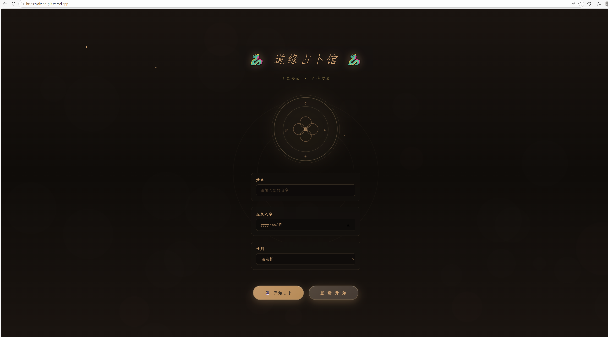

# Vibe Coding 实践报告
---

## 一、 实践方向与工具

* **实践工具**：VS Code + GitHub Copilot (AI 辅助编程)
* **技术栈**：HTML5 + CSS3 (Animation) + Vanilla JavaScript (单文件架构)
* **实践方向**：
尝试通过 Vibe Coding 的方式，构建一个“赛博玄学”风格的动态占卜网站。
核心目标是利用 AI 快速实现复杂的视觉动效（如粒子系统、光晕呼吸、3D翻转），将传统文化元素（八卦、干支、五行）与Web 交互技术结合。

---

## 二、 核心实践过程

实践采用了 **Vibe Coding ** 模式，我不再关注底层语法细节，而是作为“产品经理”和“技术总监”，通过自然语言指挥 Copilot 完成从 UI 设计到核心算法的实现。

### 1. 沉浸式 UI 构建 (Prompting Visuals)

我首先通过 Prompt 定义了“古典中国风 + 神秘感”的视觉基调。利用 Copilot 快速生成了复杂的 CSS 动画，例如**八卦背景旋转**和**水墨粒子效果**。

* **核心实现片段 (CSS 动画)**：
通过 AI 生成的多层级动画，实现了八卦图的呼吸与旋转效果：
```css
/* AI 生成的八卦脉冲与光晕效果 */
@keyframes baguaGlow {
    0%, 100% { filter: drop-shadow(0 0 20px rgba(212, 165, 116, 0.2)); }
    50% { filter: drop-shadow(0 0 40px rgba(212, 165, 116, 0.6)); }
}
.bagua-interactive {
    /* ...省略布局代码... */
    backdrop-filter: blur(10px); /* 磨砂玻璃质感 */
    animation: baguaPulse 3s ease-in-out infinite;
}

```


### 2. 逻辑算法生成 (Logic Generation)

在处理“生辰八字计算”这一复杂逻辑时，我没有手动查表，而是要求 AI：“根据用户输入的生日字符串，计算对应的天干地支和五行属性”。AI 自动生成了包含映射表和计算逻辑的完整函数。

* **核心实现片段 (JavaScript)**：
AI 自动补全了干支映射数组和计算公式：
```javascript
// 自动生成的干支计算逻辑（部分）
const heavenlyStemsMap = { 0: '甲', 1: '乙', ... };
const earthlyBranchesMap = { 0: '子', 1: '丑', ... };

function calculateBaZi(birthdayStr, name, gender) {
    // ... AI 补全了基于年份和日期的取模算法 ...
    const guaIndex = (yearStem + monthStem + dayStem) % 8; // 简化的卦象算法
    return {
        year: heavenlyStemsMap[yearStem] + earthlyBranchesMap[yearBranch],
        wuxing: wuxingMap[yearStem],
        // ...
    };
}

```


### 3. 动态交互增强 (Interactive Vibe)

为了增强“沉浸感”，我添加了鼠标跟随粒子和点击爆炸效果。通过简单的指令“添加鼠标移动时的拖尾粒子”，AI 生成了基于 DOM 操作的高性能粒子系统。

* **效果截图**：

> **实现效果**：点击“开始占卜”后，卡片通过 `setTimeout` 形成级联弹出的动画，营造出独特的仪式感。


---

## 三、 实践收获与疑问

### 🌟 真实实践感受 (Gains)

这次实践给我最深的感触，是编程思维真正从纠结“怎么实现”回归到了思考“想要什么”。以前为了调一个呼吸灯效或 3D 翻转，我往往要盯着代码反复微调参数，但在 Vibe Coding 模式下，我只需要告诉 AI 我想要那种“玄学的呼吸感”，代码就能瞬间生成，这种感觉让我从机械的堆砌者变成了把控全局的设计者。特别是配合单文件开发的模式，所有逻辑都在一眼能及的范围内，思维不会因为频繁切换文件而断层，这种连贯的“心流”体验非常难得。再加上像农历算法这类枯燥且容易出错的逻辑，我完全可以放心地作为“黑盒”交给 AI 处理，自己只需专注于验收结果和打磨体验，这种剥离了繁琐细节、只保留创造性核心的开发过程，确实让我感到一种前所未有的轻松与高效。


---
## 四、 欢迎体验！
**最终部署网站**：https://divine-gilt.vercel.app/

